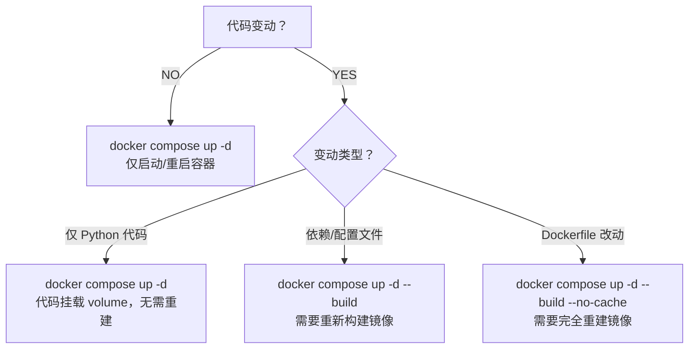

这是个很好的问题！让我给你一个清晰的决策指南：

## Docker Compose 启动策略

### 📋 决策流程图



### 🎯 具体场景

| 场景 | 命令 | 说明 |
|------|------|------|
| **日常启动/停止** | `docker compose up -d` | 仅启动容器，不构建 |
| **修改 Python 代码** | `docker compose up -d` | 代码挂载在 volume，自动生效 |
| **修改前端文件 (web/)** | `docker compose up -d` | 前端文件挂载在 volume |
| **修改依赖 (requirements.txt)** | `docker compose up -d --build` | 需要重新安装依赖 |
| **修改配置文件 (.env)** | `docker compose up -d` | 环境变量自动生效 |
| **修改 Dockerfile** | `docker compose up -d --build --no-cache** | 需要完全重建镜像 |
| **首次部署** | `docker compose up -d --build` | 构建并启动 |

### 🔄 完全重建镜像的场景

```bash
# 强制不使用缓存，完全重建
docker compose up -d --build --no-cache

# 或者分步骤
docker compose down -v      # 移除容器+卷（包括数据！）
docker compose up -d --build
```

### ⚠️ 需要完全重建的情况

1. **`Dockerfile` 本身改动**（换基础镜像、安装新软件包等）
2. **`requirements.txt` 新增/删除依赖**
3. **构建失败后重试**（清除错误缓存）
4. **镜像损坏或有安全问题**
5. **切换 Python 版本**

### ✅ 无需重建的情况

1. **修改 Python 代码**（有 volume 挂载）
2. **修改前端文件**（有 volume 挂载）
3. **修改 `.env` 环境变量**
4. **修改 Webhook URL**
5. **修改 LLM API Key**

### 📦 最佳实践建议

```bash
# 1. 修改代码后 - 最常用
docker compose up -d

# 2. 修改依赖后
docker compose up -d --build

# 3. 构建失败后
docker compose up -d --build --no-cache

# 4. 完全重置（包括数据）
docker compose down -v
docker compose up -d --build
```

### 💡 查看当前镜像

```bash
# 查看镜像
docker images | grep easy_aiReview

# 查看容器状态
docker compose ps

# 查看日志
docker compose logs -f
```

### 🧠 记忆口诀

> **"改代码不用 build，改依赖才要 build"**
> 
> - Python 代码 → volume 挂载 → `up -d`
> - requirements.txt → 镜像内安装 → `up -d --build`
