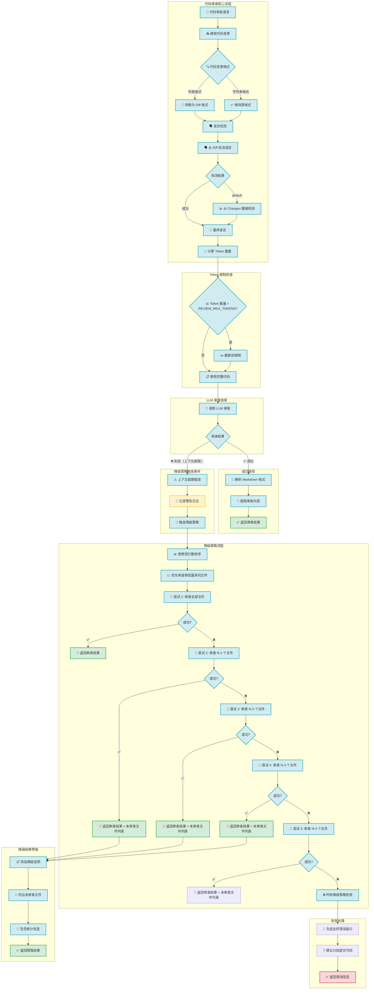

## 降级策略详细说明

### 触发条件

当 LLM 返回以下错误时，自动触发降级策略：
- `context_length_exceeded`
- `too many tokens`
- `maximum context length exceeded`
- `This model's maximum context length is ... tokens`

### 降级策略执行步骤

1. **优先级排序**：按 `additions + deletions` 降序排列，优先审查修改最多的文件
2. **逐步尝试**：
   - 尝试 1：审查全部文件
   - 尝试 2：审查 N-1 个文件
   - 尝试 3：审查 N-2 个文件
   - 尝试 4：审查 N-3 个文件
   - 尝试 5：审查 N-4 个文件

3. **安全余量**：保留 20% 的 Token 余量

### 输出示例

```markdown
## 审查结果

[正常的审查内容...]

---
⚠️ **注意**：由于代码变更过多，此审查仅包含 **5** 个修改最多的文件（共 **15** 个文件）。

### 📁 未审查的文件：
- `src/utils/helper.java`
- `src/models/service.java`
- `src/controllers/api.java`
- `src/services/business.java`
- `src/utils/validator.java`
- `src/config/database.java`
- `src/services/cache.java`
- `src/utils/logger.java`
- `src/models/dto.java`
- `src/controllers/rest.java`

### 📊 统计信息：
- **总文件数**：15
- **已审查**：5
- **未审查**：10
- **总修改行数**：2,500
```

## 配置参数

| 参数 | 默认值 | 说明 |
|------|--------|------|
| `REVIEW_MAX_TOKENS` | 15000 | 每次审查的最大 Token 限制 |
| `REVIEW_STYLE` | professional | 审查风格（professional/sarcastic/gentle/humorous） |
| `降级安全余量` | 0.8 | 降级策略中保留的 Token 安全比例 |

## 适用场景

✅ **大型代码库**：单次提交包含大量文件修改
✅ **复杂重构**：涉及多个模块的大规模代码变更
✅ **资源受限**：LLM 上下文窗口较小的情况
✅ **性能优化**：需要控制 API 调用的 Token 消耗

---

*💡 建议：如果代码变更持续过多，考虑将代码分批提交进行审查*
